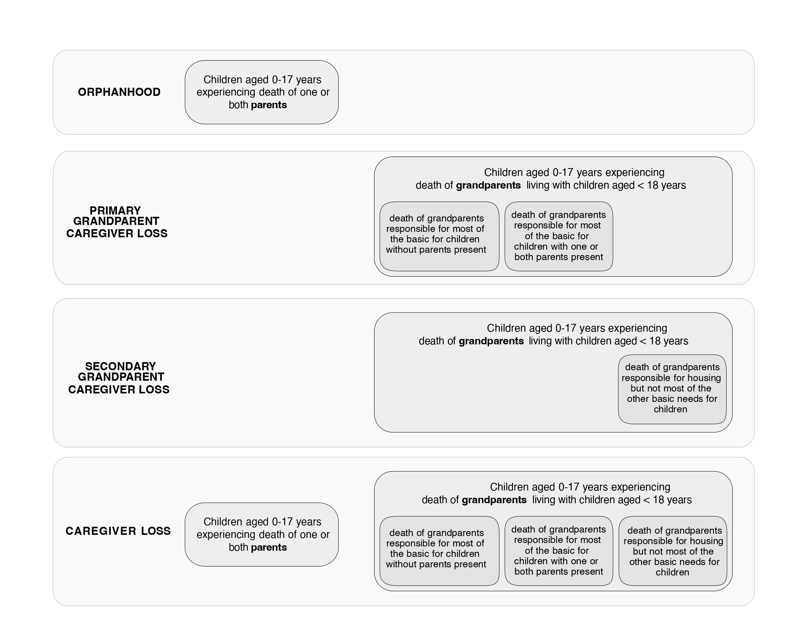

```{r setup, include = FALSE}
knitr::opts_knit$set(
  collapse = TRUE,
  comment = "#>",
  root.dir = '.'
)
analysis <- 'Q1_2023'
analysis_date <- '31st March 2022'
```

```{r, include=TRUE, eval=TRUE, echo=FALSE, warning=FALSE, message=FALSE, tidy=TRUE}
require(knitr)
require(kableExtra)
require(ggplot2)
require(ggpubr)
require(gridExtra)
require(albersusa)
require(data.table)
require(tidyr)
require(dplyr)
require(tidyverse)
require(leaflet)
require(maps)
require(geojsonio)
require(DT)
require(plotly)
library(ggsci)
require(geofacet)
require(RColorBrewer)
require(scales)
library(imager)
library(RCurl)
library(openxlsx)
library(sf)
library(tigris)
library(rmapshaper)
library(ggpattern)
require(htmltools)
library(htmlwidgets)
```

```{r, include=FALSE, eval=FALSE, echo=FALSE, warning=FALSE, message=FALSE, tidy=TRUE}
require(rmarkdown)
rmarkdown::render('US_all_causes_deaths_website_1.Rmd')
```
# Magnitude of caregiver loss and orphanhood in the United States by all causes of deaths 1999-2021


### Orphanhood and grandparent caregiver loss defined

Definitions of orphanhood and grandparent caregiver loss, and comparison to definitions in previous studies.

```{r, include=TRUE, eval=TRUE, echo=FALSE, warning=FALSE, message=FALSE, tidy=TRUE,out.width="100%", fig.align='center'}

```


| <span style="color:white">**Section**</span> | <span style="color:white">**Content**</span> |
| -------------- | -------------------------------------------------------------------------------------------------------------------------------------------------------------------------------------------------------------------------------------------------------------------------------------------------------------------------------------------------------------------------------------------------------------------------------------------------------------------------------------------------------------------------------------------------------------------------------------------------------------------------------------------- |
| **Background** | Deaths of parents and grandparent caregivers threaten child wellbeing due to losses of financial support, housing, safety, family stability, and care globally, but are rarely recognized as a public health crisis. For some important causes, orphanhood is preventable – for example, prescription drug overdose due to depression, as recent reports highlight. For all causes, evidence shows that long-term negative impacts of orphanhood and co-residing caregiver loss are preventable: with strong positive parenting, economic and educational support for surviving caregivers, children’s outcomes can be equal to those of non-orphaned children. Little is known about the full burden, trends, and disparities in all-cause and cause-specific orphanhood and caregiver loss, beyond estimates from select causes. |
| **Main Findings and Limitations** | In the U.S., incidence and prevalence trends in orphanhood and co-residing primary and secondary grandparent caregiver loss increased in total by 49.5% and 7.9%, respectively, from 2000-2021. In 2021, 2.38 million children (3.4% of children) had in their lifetime experienced prevalent orphanhood, 217,000 (0.3%) primary grandparent caregiver loss (providing most basic needs), and 342,000 (0.5%) secondary grandparent caregiver loss (providing housing but not most other basic needs). Evidence shows that co-residing grandparents also provide salient nurturing and practical care. We found 66.8% of orphaned children lost their father in their lifetime, and 33.2% lost their mother. Populations disproportionately affected by orphanhood included 5.2% of all adolescents; 6.4% and 4.7% respectively of non-Hispanic American Indian/Alaska Native and non-Hispanic Black children. In 2021, prevalent orphanhood of 3% or greater was pervasive across states, and highest (approximately 5%) in West Virginia, New Mexico, Mississippi, Louisiana, and Kentucky. Since 2021, parental death due to drug overdose increased to historic levels surpassing COVID-19 as the leading cause of incident and prevalent orphanhood nationally during the COVID-19 pandemic. However, the highest cause of orphanhood in 2021 for every minoritized subgroup was not drug overdose but varied for paternally orphaned children from heart disease to COVID-19, for non-Hispanic American Indian or Alaska Native, non-Hispanic Black, Hispanic children, and non-Hispanic Asian children. Variations in leading causes of maternal orphanhood included cirrhosis, COVID-19, and cancer in these minoritized subgroups. Our state-specific analyses showed that orphanhood due to fatal injuries– drug overdose, suicide, homicide, and unintentional injuries– exceeded those linked to leading chronic diseases and were among the top two causes of orphanhood in 48 states. A key limitation is that our estimates for the number of children affected by orphanhood and caregiver death may be underestimated for causes associated with erroneous or incomplete reporting; underreporting of caregiver loss is also likely due to unavailability of data on the numbers of children in the care of co-resident grandparents. |
| **Policy Implications** | Policies and programs that provide healing and support for 3 million children in the U.S. who have experienced orphanhood and caregiver loss may contribute to reducing acute and long-term negative effects of this adverse childhood experience. Globally, caregiver loss prevalences are likely above 4% among children in countries where fertility rates and parental death rates are higher than in the U.S. Evidence highlights three essential components of orphanhood prevention and response that effectively promote their recovery and resilience and can guide policy investments for both all-cause and cause-specific orphanhood and caregivers: (1) prevent death of parents/caregivers through timely prevention and treatment of leading causes of death and ensured access to health and mental health care for all; (2) prepare families to provide safe and nurturing alternative care; and (3) protect children affected by orphanhood and vulnerabilities, through grief and mental health counseling, and parenting, economic, and educational support. Given the scope of orphanhood/caregiver loss and associated threats to the mental and physical health, and lifelong wellbeing of children, these strategies can be contextualized and prioritized. |

### Trends in All-cause Orphanhood and Caregiver Death from 2000 to 2021, before and during the pandemic


```{r, include=TRUE, out.width="100%", fig.show='hold', fig.align='center', echo=FALSE,warning=FALSE}
prevalence <- readRDS("results_output/data_table1.RDS")
colnames(prevalence) <- c('', '', '2000(Number of Children)', '2019(Number of Children)', '2000-2019 changes', '2020(Number of Children)', '2021(Number of Children)', '2019-2021  changes', '2000-2021 changes')
kbl(prevalence) %>%
  kable_paper() %>%
  add_header_above(c('', '', "Before the COVID-19 pandemic" = 3, "Since the COVID-19 pandemic" = 4))%>%
  pack_rows("Incidence (n, (95% uncertainty interval))", 1, 8)%>%
  pack_rows("Incidence rate per 100 children (rate, (95% uncertainty interval))", 9, 16)%>%
  pack_rows("Prevalence (n, (95 uncertainty interval))", 17, 24)%>%
  pack_rows("revalence rate per 100 children (rate, (95% uncertainty interval))", 25, 32)
```
<br><br><br>


```{r, include=TRUE, out.width="100%", fig.show='hold', fig.align='center', echo=FALSE,warning=FALSE}
fig1a <- readRDS("results_output/data_figure1a.RDS") + theme(legend.position="none", axis.text = element_text(size=10), axis.title.y = element_text(size = 10))#, tooltip="text")
fig1b <- readRDS("results_output/data_figure1b.RDS") + theme(legend.position="none", axis.text = element_text(size=10), axis.title.y = element_text(size = 10))#, tooltip="text")
fig1c <- readRDS("results_output/data_figure1c.RDS") + theme(legend.position="none", axis.text = element_text(size=10), axis.title.y = element_text(size = 10)) + geom_point(size=1.5) + geom_line(size =0.5)#, tooltip="text")
fig1d <- readRDS("results_output/data_figure1d.RDS") + theme(legend.position="none", axis.text = element_text(size=10), axis.title.y = element_text(size = 10)) + geom_point(size=1.5) + geom_line(size=0.5)#, tooltip="text")
fig1e <- readRDS("results_output/data_figure1e.RDS") + theme(axis.text = element_text(size=10), axis.title.x = element_text(size=10), strip.text=element_text(size=10), legend.text=element_text(size=8), legend.title=element_text(size=10), legend.key.size = unit(0.5,'cm'))
a = ggplotly(ggplotly(fig1e), tooltip="text")

nlists<-length(a$x$data)
for (i in 1:nlists) {
  a$x$data[[i]]$name <- gsub(',1','', a$x$data[[i]]$name)
  a$x$data[[i]]$name<- gsub("\\(|\\)",'', a$x$data[[i]]$name)
  a[["x"]][["data"]][[i]][["text"]] <- ''
}
combined_plot <- subplot(ggplotly(ggplotly(fig1a), tooltip="text"),
                         ggplotly(ggplotly(fig1b), tooltip="text"),
                         ggplotly(ggplotly(fig1c), tooltip="text") %>% layout(yaxis = list(title=list(standoff= 26L))),
                         ggplotly(ggplotly(fig1d), tooltip="text") %>% layout(yaxis = list(title=list(standoff= 11L))),
                         nrows = 2, titleX = TRUE, titleY = TRUE, margin = c(0.1,0.1,0.15,0.15)) %>% 
  layout(annotations=list(text=c('a', 'b', 'c', 'd'), xref='paper', x=c(-0.05, 0.54, -0.05, 0.54), yref='paper', y=c(1.07, 1.07, 0.46, 0.46), showarrow=F))
combined_plot
a %>% layout(legend=list(traceorder="reversed"), textposition="top", autosize=F,
             width= 1000,
             annotations=list(text='e', xref='paper', yref='paper', x=-0.07, y=1.12, showarrow=F))
```
#### Fig. 1: Magnitude of children experiencing orphanhood in the U.S. 
 <span> (a) </span> Estimated
 number of U.S. children newly experiencing orphanhood by any cause and over time.
 (b) Estimated number of U.S. children experiencing orphanhood in their lifetime by
 any cause and over time. (c) Incidence rates of orphanhood among U.S. children. (d)
 Prevalence rates of orphanhood among U.S. children, calculated by aggregating inci
dence estimates among children over the previous 17 years and accounting for ageing
 of children. (e) Main contributors to orphanhood incidence versus to adult deaths in
 2021. Throughout, median estimates are shown (points, bars, and values shown in
 text), and uncertainty ranges are detailed in Supplementary Table 17, except for (e)
 where 95% uncertainty intervals are also shown as error bars. Incidence estimates
 are based on at least n=2,357,714 mortality records and n=3,610,887 natality records
 per year. Cause-specific incidence estimates are based on at least n=14,854 mortality
 records per year.
<br><br><br>

```{r, include=TRUE, out.width="100%", fig.show='hold', fig.align='center', echo=FALSE,warning=FALSE}
fig2a <- readRDS("results_output/data_fig2a.RDS")
fig2b <- readRDS("results_output/data_fig2b.RDS")
fig2c <- readRDS("results_output/data_fig2c.RDS")
fig2d <- readRDS("results_output/data_fig2d.RDS")
fig2e <- readRDS("results_output/data_fig2e.RDS")
data = fig2a$data
  
  
  # Create the grouped bar chart
fig2A =  ggplot(data, aes(x = M, y = grp, fill = variable,text = paste("Value:", M, "[", CL,CU,']'))) +
    geom_bar(stat = "identity", position = position_dodge(width = 0.9), width = 0.8) +
    labs(title = "Orphanhood Prevalence Rate per 100 Children in 2021") +
    geom_errorbarh(aes(xmin = CL, xmax = CU, y = grp, group = variable), height = 0.2, position = position_dodge(width = 0.9))+
    theme_minimal()+ theme(legend.position = "none")
  
a  = ggplotly(fig2A, tooltip = "text")
a[["x"]][["layout"]][["xaxis"]][["title"]][["text"]] = ""
a[["x"]][["layout"]][["yaxis"]][["title"]][["text"]] = ""

 fig2b <- readRDS("results_output/data_fig2b.RDS")
      data = fig2b$data
      # Calculate the maximum value across all age groups for y-axis limits
      max_value <- max(data$value, data$cu) + 2
      plots <- list()
      
      color_palette <- c("#59B0F6", "#CF6949", "#6F7DC7", "#F39141", "#FCD062")
      # Create a subplot for each age group
      plots <- lapply(unique(data$age.group), function(age) {
        age_data <- data %>% filter(age.group == age)
        
        plot_ly(data = age_data, 
                x = ~race.eth, 
                y = ~value, 
                type = 'bar', 
                name = age,
                color = ~race.eth, # Color by race.eth
                colors = color_palette,
                error_y = list(
                  type = "data", 
                  array = age_data$cu - age_data$value, 
                  arrayminus = age_data$value - age_data$cl,
                  color = "black"  # Set error bars color to black
                )) %>%
          layout(font = list(size=8),
            xaxis = list(title = "Race/Ethnicity"),
            yaxis = list(title = "Value", range = c(0, max_value)),
            showlegend = FALSE  # Hide legends for clarity
          )
      })
      
      # Combine plots into a single figure sharing the y-axis
      final_plot <- subplot(plots, nrows = 1, shareY = TRUE) %>%
        layout(yaxis = list(title = "Orphanhood Prevalence Rate per 100 Children in 2021", range = c(0, max_value)),
               annotations = list( 
                 list( 
                   x = 0.15,  
                   y = 0.95,  
                   text = "Age Group 0-4",  
                   xref = "paper",  
                   yref = "paper",  
                   xanchor = "center",  
                   yanchor = "bottom",  
                   showarrow = FALSE
                 ),  
                 list( 
                   x = 0.5,  
                   y = 0.95,  
                   text = "Age Group 5-9",  
                   xref = "paper",  
                   yref = "paper",  
                   xanchor = "center",  
                   yanchor = "bottom",  
                   showarrow = FALSE 
                 ),  
                 list( 
                   x = 0.85,  
                   y = 0.95,  
                   text = "Age Group 10-17",  
                   xref = "paper",  
                   yref = "paper",  
                   xanchor = "center",  
                   yanchor = "bottom",  
                   showarrow = FALSE 
                 )
               ))
      
      # Show the combined plot

combine1 <- subplot(a, final_plot, nrows = 1, margin = 0.02, widths = c(0.35, 0.65))
combine2 <- subplot(fig2c, fig2d, fig2e, nrows = 1, margin = 0.03)
combine1 <- layout(combine1, width = 1000)
combine2 <- layout(combine2, width = 1000)
combine1
combine2
```
#### Fig. 2: Differences and time trends in orphanhood among U.S. children by age, sex, standardised race & ethnicity and cause.
<span> (a) </span> Orphanhood prevalence rate of
 all-cause orphanhood by sex of parent, age of child and standardised race & ethnicity
 of child/parent in 2021. (b) Orphanhood prevalence rates by race & ethnicity in each
 age group among U.S. children. (c-e) Time trends in prevalence rates of maternal
 orphanhood and parental orphanhood, age-of-child, and race & ethnicity of child/
parent. Throughout, median estimates (points, bars, and values shown in text) are
 shown along with 95% uncertainty intervals (error bars). Estimates are based on at
 least n=148,850 group-specific mortality records and n=642,737 group-specific na
tality records per year.
<br><br><br>

```{r, include=TRUE, out.width="100%", fig.show='hold', fig.align='center', echo=FALSE,warning=FALSE}
fig3a <- readRDS('results_output/data_fig3a.RDS') + theme(legend.position = "none", axis.text=element_text(size=12), axis.title=element_text(size=10))
fig3b <- readRDS('results_output/data_fig3b.RDS') + theme(legend.position='bottom',axis.text=element_text(size=12), axis.title=element_text(size=12))
fig3aa <- ggplotly(fig3a)
for(i in seq(from=3, to=7)){
  fig3aa$x$layout$annotations[[i]]$font$size=16
}
fig3aa %>% layout(font=list(size=16),legend=list(font=list(size=16),
                             title=list(font=list(size=16), side="top"),
                             visible=TRUE),autosize=F, height = 500, width = 900,
                 annotations=list(text=c('a'), xref='paper', x=c(-0.05), yref='paper', y=c(1.10), showarrow=F))

fig3bb <- ggplotly(fig3b)
fig3bb %>% layout(legend=list(orientation="h", y=-0.1, font=list(size=16),
                             title=list(font=list(size=16), side="top"),
                             visible=TRUE),
                 autosize=F, height = 1400, width = 900,
                 annotations=list(text=c('b'), xref='paper', x=c(-0.05), yref='paper', y=c(1.07), showarrow=F))

```

<br><br><br><br><br><br><br><br><br><br><br><br><br><br><br><br><br><br><br><br><br><br><br><br><br><br><br>
<br><br><br><br><br><br><br><br><br><br><br><br><br><br><br><br><br><br>

### Fig. 3: Leading causes of orphanhood incidence among U.S. children in 2021by race & ethnicity and sex of parent. 
<span> (a) </span> Estimates of 2021 paternal orphanhood
 incidence (y-axis) by cause-of-death of fathers (point/number/colour) and race &
 ethnicity (panels) versus differences in incidence rates in 2021 minus those in 2000
 (x-axis), with positive differences indicating increasing incidence rates and negative
 differences indicating decreasing incidence rates. The size of points indicates the
 contribution of each cause to new cases of orphanhood among U.S. children in 2021.
 (b) Same for 2021 maternal orphanhood incidence by cause-of-death of mothers.
 Median estimates are shown (points) and uncertainty ranges are detailed in Supple
mentary Table 12. 2021 incidence estimates are based on an average of n=5,791
 sex/race/ethnicity/cause-specific mortality records, and an average of n=610,229 race
 &ethnicity-specific natality records.
<br><br><br>

### Spatial distribution of US children experiencing parental death in 2021 {.tabset .tabset-fade}

#### Incidence

Total number of children newly experiencing parental death per 100,000 in 2021.

```{r, include=TRUE, out.width="100%", fig.show='hold', fig.align='center', echo=FALSE,warning=FALSE}
orphanhood <- data.table(read.csv('results_output/DataMap3.csv'))

# basic file for the map
spdf <- readRDS('results_output/download_spdf.RDS')
states <- 
    geojson_read( 
        x = "https://raw.githubusercontent.com/PublicaMundi/MappingAPI/master/data/geojson/us-states.json"
        , what = "sp"
    )
us_states_centres <- read.csv("data/us_states_centres.csv")
us_states_centres$W <- - us_states_centres$W
# Change Alaska and Hawaii coordinates to match those on the map
us_states_centres$W[2] <- -112
us_states_centres$N[2] <- 27.25
us_states_centres$W[12] <- -103.8255
us_states_centres$N[12] <- 27.0451
epsg2163 <- leafletCRS(
  crsClass = "L.Proj.CRS",
  code = "EPSG:2163",
  proj4def = "+proj=laea +lat_0=45 +lon_0=-100 +x_0=0 +y_0=0 +a=6370997 +b=6370997 +units=m +no_defs",
  resolutions = 2^(16:7))
spdf <- merge(spdf,subset(orphanhood,select=c('State','Incidence.rate', 'First.ranked.cause..Incidence.')),by.x='name',by.y='State',all=T)
spdf <- merge(spdf,us_states_centres, by.x='name', by.y='State', all=T)
spdf <- subset(spdf,!is.na(name))
iconmap <- function(cause){
  if(cause == "Diseases of heart"){
    file.path("figures/heart.svg")
  }
  else if (cause == "Unintentional injuries\nexcluding drug overdose"){
    file.path("figures/unintentional_injury.svg")
  }
  else if (cause == "COVID-19"){
    file.path("figures/covid.svg")
  }
  else if (cause == "Drug overdose"){
    file.path("figures/drug.svg")
  }
  else if (cause == "Malignant neoplasms"){
    file.path("figures/neoplasm.svg")
  }
  else if (cause == "Chronic liver disease and cirrhosis"){
    file.path("figures/liver.svg")
  }
  else if (cause == "Suicide"){
    file.path("figures/suicide.svg")
  }
}
icondim <- 25
causeIcons <- icons(
  iconUrl = unlist(lapply(spdf$First.ranked.cause..Incidence., iconmap)),
  iconWidth=icondim, iconHeight=icondim,
  iconAnchorX=icondim/2, iconAnchorY=icondim/2
)
# get the count
#legend.cause <- orphanhood[, .N, by = c('First.ranked.cause')]
# Check
html_legend <- paste0("<b>Leading parental cause-of-death<br>(# of states)</b><br>",
                      "</object> Drug overdose (34)<br/>",
                      " COVID-19 (8)<br/>",
                      " Unintentional injuries<br>excluding drug overdose (3)<br/>",
                      " Heart disease (3)<br/>",
                      " Malignant neoplasms (2)<br/>",
                      " Chronic liver disease<br>and cirrhosis (1)<br/>")
bins <- c(.36,0.5,0.6, 0.7,.89)
magma <- colorBin(c("#F8765CFF","#D3436EFF","#982D80FF", "#5F187FFF"), domain = orphanhood$Incidence.rate, bins = bins, na.color = NA)
labels=paste0("<b>State :</b> ", spdf$name,
              "<br><b>Incidence rate per 100 children:</b> ", spdf$Incidence.rate,
              "<br><b>Total incidence:</b> ", spdf$Incidence,
              "<br><b>Leading parental cause-of-death in 2021:</b> ", spdf$First.ranked.cause..Incidence.) %>%
  lapply(htmltools::HTML)
backg <- htmltools::tags$style(".leaflet-container { background: white; }" )
map_inc <- leaflet(spdf, options = leafletOptions(crs = epsg2163  
                                                  , zoomControl = FALSE)) %>%
  setView(-96, 37.8, 3) %>%
  #setView(-96, 47, 3) %>%
  addProviderTiles("MapBox", options = providerTileOptions(
    id = "mapbox.light",
    accessToken = Sys.getenv('MAPBOX_ACCESS_TOKEN'))) %>%
  addPolygons(
    fillColor = ~magma(orphanhood$Incidence.rate),
    weight = .5,
    opacity = 1.0,
    color = "white",
    dashArray = "3",
    fillOpacity = 1.0,
    highlight = highlightOptions(
      weight = 5,
      color = "white",
      dashArray = "",
      fillOpacity = 1.0,
      bringToFront = TRUE),
    label = labels,
    labelOptions = labelOptions(
      style = list("font-weight" = "normal", padding = "3px 8px"),
      textsize = "15px",
      direction = "auto")) %>%
  addLegend(pal = magma, values = round(orphanhood$Incidence.rate, 2), 
            # labFormat = labelFormat(suffix = "%"), 
            opacity = 1.0, title = "Orphanhood incidence <br> per 100 Children",
    position = "topright"
  ) %>%
  addMarkers(lat=spdf$N, lng=spdf$W, icon=causeIcons) %>%
  addControl(html = html_legend, position = "bottomright")  %>%
htmlwidgets::prependContent(backg)

map_inc
```

#### Prevalence

Total number of children experiencing parental death per 100,000 in 2021.

```{r, include=TRUE, out.width="100%", fig.show='hold', fig.align='center', echo=FALSE,warning=FALSE} 
orphanhood <- data.table(read.csv('results_output/DataMap3.csv'))
orphanhood <- transform(orphanhood, Prevalence.rate = as.numeric(gsub(",", "", orphanhood$Prevalence.rate)))

spdf <- readRDS('results_output/download_spdf.RDS')
states <- 
    geojson_read( 
        x = "https://raw.githubusercontent.com/PublicaMundi/MappingAPI/master/data/geojson/us-states.json"
        , what = "sp"
    )

us_states_centres <- read.csv("data/us_states_centres.csv")
us_states_centres$W <- - us_states_centres$W
# Change Alaska and Hawaii coordinates to match those on the map
us_states_centres$W[2] <- -112
us_states_centres$N[2] <- 27.25
us_states_centres$W[12] <- -103.8255
us_states_centres$N[12] <- 27.0451

epsg2163 <- leafletCRS(
  crsClass = "L.Proj.CRS",
  code = "EPSG:2163",
  proj4def = "+proj=laea +lat_0=45 +lon_0=-100 +x_0=0 +y_0=0 +a=6370997 +b=6370997 +units=m +no_defs",
  resolutions = 2^(16:7))

spdf <- merge(spdf,subset(orphanhood,select=c('State','Prevalence.rate', 'First.ranked.cause..Prevalence.')),by.x='name',by.y='State',all=T)
spdf <- merge(spdf,us_states_centres, by.x='name', by.y='State', all=T)
spdf <- subset(spdf,!is.na(name))


iconmap <- function(cause){
  if(cause == "Diseases of heart"){
    file.path("figures/heart.svg")
  }
  else if (cause == "Unintentional injuries\nexcluding drug overdose"){
    file.path("figures/unintentional_injury.svg")
  }
  else if (cause == "COVID-19"){
    file.path("figures/covid.svg")
  }
  else if (cause == "Drug overdose"){
    file.path("figures/drug.svg")
  }
  else if (cause == "Malignant neoplasms"){
    file.path("figures/neoplasm.svg")
  }
  else if (cause == "Chronic liver disease and cirrhosis"){
    file.path("figures/liver.svg")
  }
  else if (cause == "Suicide"){
    file.path("figures/suicide.svg")
  }
}
icondim <- 25
causeIcons <- icons(
  iconUrl = unlist(lapply(spdf$First.ranked.cause..Prevalence., iconmap)),
  iconWidth=icondim, iconHeight=icondim,
  iconAnchorX=icondim/2, iconAnchorY=icondim/2
)

html_legend <- paste0("<b>Leading parental cause-of-death<br>(# of states)</b><br>",
                      " Drug overdose (30)<br/>",
                      " Unintentional injuries<br>excluding drug overdose (12)<br/>",
                      " Malignant neoplasms (6)<br/>",
                      " Heart disease (3)<br/>")
# if 100 and 5 categories
bins <- c(2.00, 3.0, 3.75, 4.5, 5.0) # , "#7F0000", "#FFFF40"
prev <- colorBin(c("#ff6600", "#e42309", "#B71C1C", "#7F0000"), domain = orphanhood$Prevalence.rate, bins = bins, na.color = NA) # D50000  "#FF0000", "#BD0026"
labels = paste0("<b>State :</b> ", spdf$name,
                "<br><b>Prevalence rate per 100 children:</b> ", formatC(spdf$Prevalence.rate, digits=0, format="f", big.mark=","),
                "<br><b>Total prevalence:</b> ", spdf$Prevalence,
                "<br><b>Leading parental cause-of-death in 2021:</b> ", spdf$First.ranked.cause..Incidence.) %>%
  lapply(htmltools::HTML)
legend_html <- "
<div style='background-color: #ff6600; padding: 10px; border-radius: 8px; box-shadow: 0px 0px 5px rgba(0,0,0,0.3);'>
  <h4 style='margin: 0; padding: 0;'>Legend Title</h4>
  <div style='display: flex; align-items: center;'>
    <div style='width: 20px; height: 20px; background-color: yellow; margin-right: 8px;'></div>
    <span>Category 1</span>
  </div>
  <div style='display: flex; align-items: center;'>
    <div style='width: 20px; height: 20px; background-color: red; margin-right: 8px;'></div>
    <span>Category 2</span>
  </div>
</div>
"
map_prev <- leaflet(spdf, options = leafletOptions(crs = epsg2163
                                                   , zoomControl = FALSE)) %>%
  setView(-96, 37.8, 3) %>%
  #setView(-96, 47, 3) %>%
  addProviderTiles("MapBox", options = providerTileOptions(
    id = "mapbox.light",
    accessToken = Sys.getenv('MAPBOX_ACCESS_TOKEN'))) %>%
  addPolygons(
    fillColor = ~prev(orphanhood$Prevalence.rate),
    weight = .5,
    opacity = 1,
    color = "white",
    dashArray = "3",
    fillOpacity = 1.0,
    highlight = highlightOptions(
      weight = 5,
      color = "white",
      dashArray = "",
      fillOpacity = 1.0,
      bringToFront = TRUE),
    label = labels,
    labelOptions = labelOptions(
      style = list("font-weight" = "normal", padding = "3px 8px"),
      textsize = "15px",
      direction = "auto")) %>%
  addLegend(pal = prev, values = orphanhood$Prevalence.rate, 
            # labFormat = labelFormat(suffix = "%"), 
            opacity = 1, title = "Orphanhood prevalence <br> per 100 children",
   position = "topright"
  ) %>%
  addMarkers(lat=spdf$N, lng=spdf$W, icon=causeIcons) %>%
  addControl(html = html_legend, position = "bottomright")  %>%
  htmlwidgets::prependContent(backg)
map_prev
```
### Fig.4:Spatial distribution of U.S. children experiencing orphanhood in 2021.
<span> (a) </span> Map of orphanhood incidence rates per 100 children(colour) by state and leading cause(symbol).(b)Map of orphanhood prevalence rate per 100 children(colour)
 by state and leading cause(symbol). Median estimates are shown(colours) and un
certainty ranges are detailed in Supplementary Table14. Incidence estimates for
 2021 are based on an average of n=5,071 state/cause-specific mortality records and
 n=71,792 state-specific fatality records,and prevalence estimates are based on aggregating incidence estimates among children over the previous 17years while
 accounting for ageing. Basemaps from Map box and OpenStreetMap were generated by ‘Leaflet’ package version2.2.0 in Runder a Creative Commons license
 https://creativecommons.org/licenses/by-sa/2.0/.


### Further information

This is an official product of the Global Reference Group for Children Affected by COVID-19 (with members from Imperial College London, WHO, World Bank, CDC, USAID, University of Oxford, University College London, Harvard University, Maestral International, and World Without Orphans); the WHO Collaborating Centre for Infectious Disease Modelling within the MRC Centre for Global Infectious Disease Analysis, Jameel Institute, Imperial College London; and the Department of Social Policy and Intervention and the Department of Computer Science, University of Oxford.

This website has been built and reviewed by Linden Graves, Douhan Wang, Victor Kojey-Merle, Yu Chen, Alexandra Blenkinsop and Oliver Ratmann.

